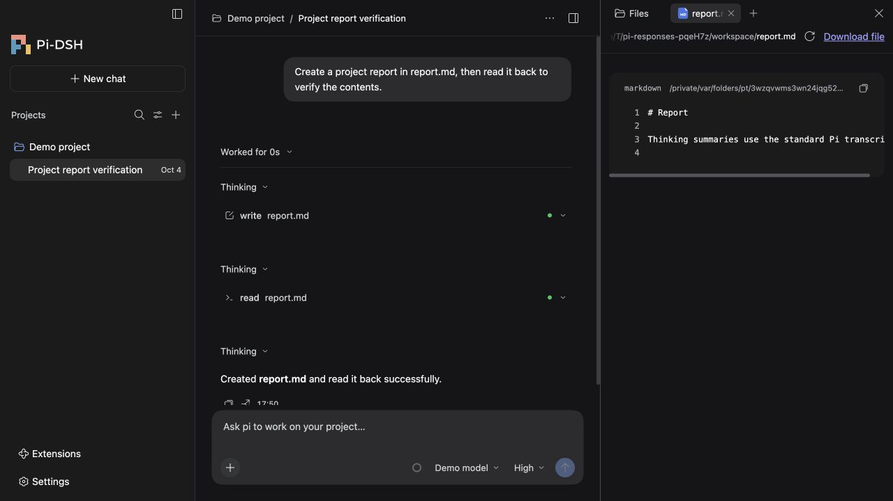

# Pi-DSH

English | [中文](README.zh.md)

A desktop workspace for the [Pi Coding Agent](https://github.com/earendil-works/pi), built with the UI components of DeepSeek Harness. Bring Pi's extensibility, native sessions and coding tools to a graphical interface—or use the same workspace in your local browser.



## Highlights

- **Pi's plugin ecosystem, on desktop.** Browse the [Pi package gallery](https://pi.dev/packages), install packages from npm, Git or local paths, and manage extensions, skills and prompt templates. Custom tools, slash commands and standard Pi dialogs work through the native runtime. [Compatibility details](docs/pi-desktop/extensions.md).
- **Branch and resume conversations.** Explore Pi's session tree, continue from an earlier user or assistant message, fork a new chat, and reopen native Pi history.
- **Stay in control during a task.** Steer the current run, queue follow-up messages, stop execution, and compact context through Pi's own controls.
- **Choose your model and thinking level.** Configure providers, use Pi-supported API-key or OAuth login, and carry your last model and thinking level into new chats.
- **A practical coding workspace.** Project-grouped history, model-generated chat titles, streaming Markdown and math, file and diff previews, Git controls, terminals, and spreadsheet/document previews.

Pi runs independently and stays unmodified. Compatible Pi upgrades do not require rebuilding Pi-DSH. Packages that depend on custom terminal interfaces still need the Pi terminal; they do not automatically become desktop widgets.

## Get started

Requires Node **22.19+ in the 22.x series, or 24+**, and **pnpm 11.7.0**. From a checkout of `pi-dsh`:

```sh
pnpm install
pnpm pi:install 0.99.1
pnpm dev:desktop
```

Use `pnpm dev:web` for the local browser interface. Open **Settings → Models and providers** to connect a model, choose a project, and send a message. Pi-DSH uses Pi's native configuration and session storage.

macOS, Windows and Linux packaging targets are included; current hands-on desktop validation is on macOS arm64. See [setup and upgrades](docs/pi-desktop/README.md) for packaging, runtime selection and platform limits.

## Contribute

See [contributing](CONTRIBUTING.md), [architecture](docs/architecture.md), [testing](docs/testing.md) and [safety](SAFETY.md). Pi and its extensions run with your user permissions.

## License and credits

[MIT](LICENSE). Pi-DSH is an independent community project built on [Pi](https://github.com/earendil-works/pi) and components from [DeepSeek Harness](https://github.com/deepseek-ai/deepseek-harness). Upstream copyrights and [third-party notices](THIRD_PARTY_NOTICES.md) are preserved.

Questions, ideas and bug reports are welcome—please open an issue!
